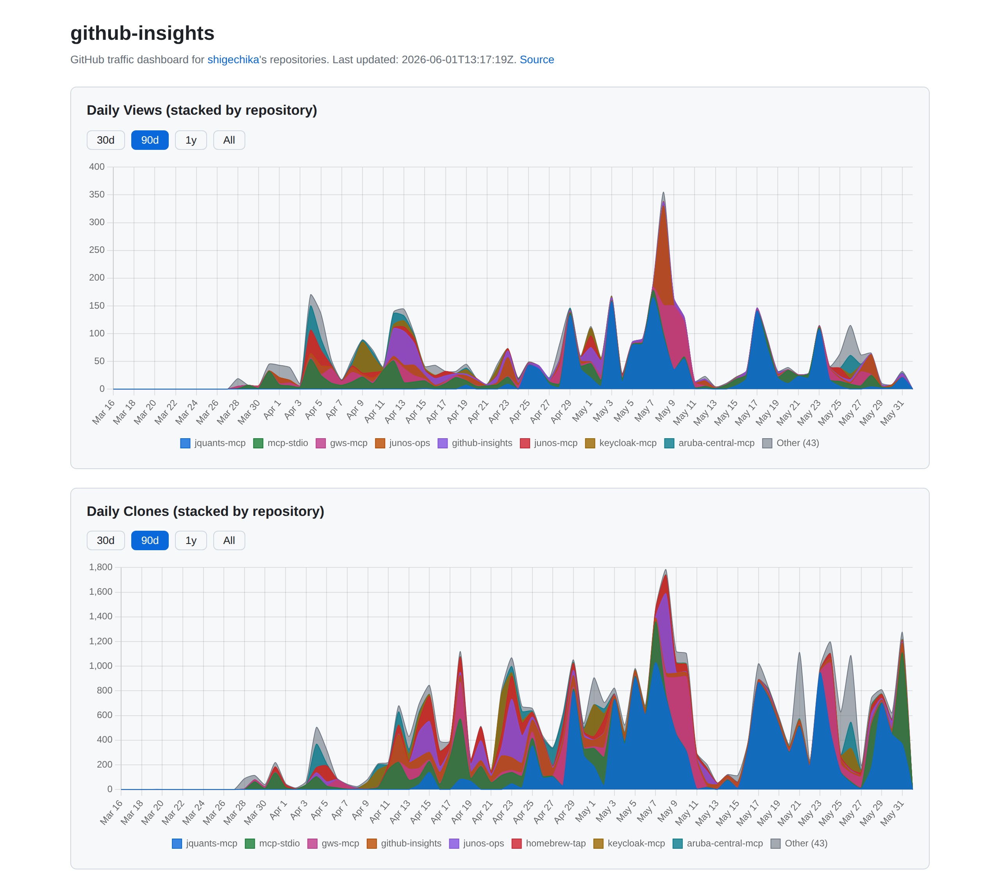
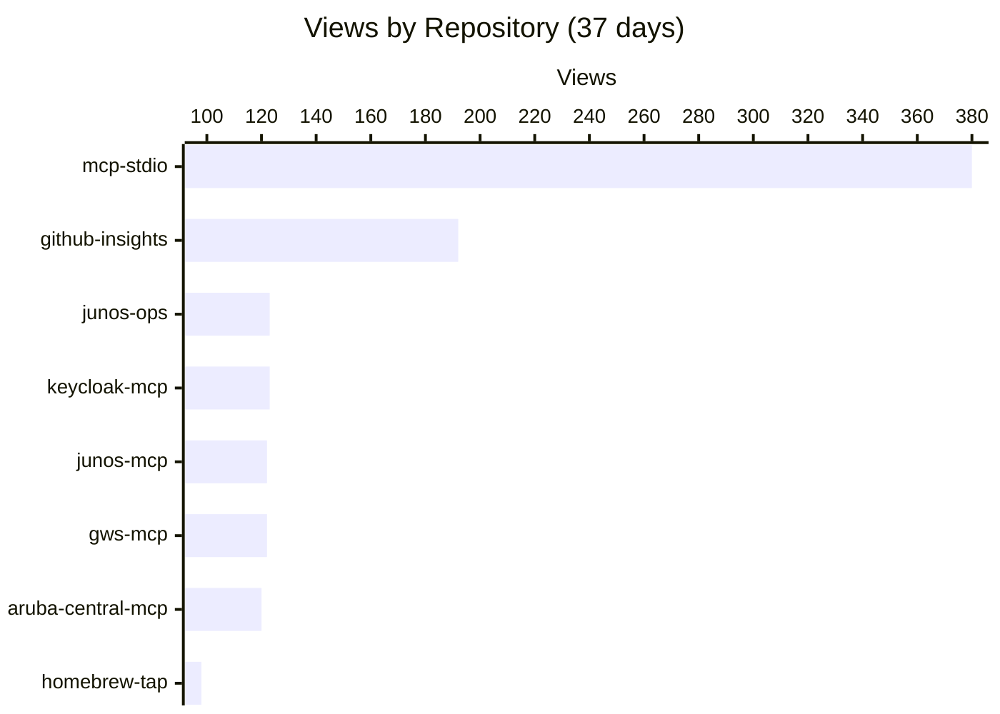
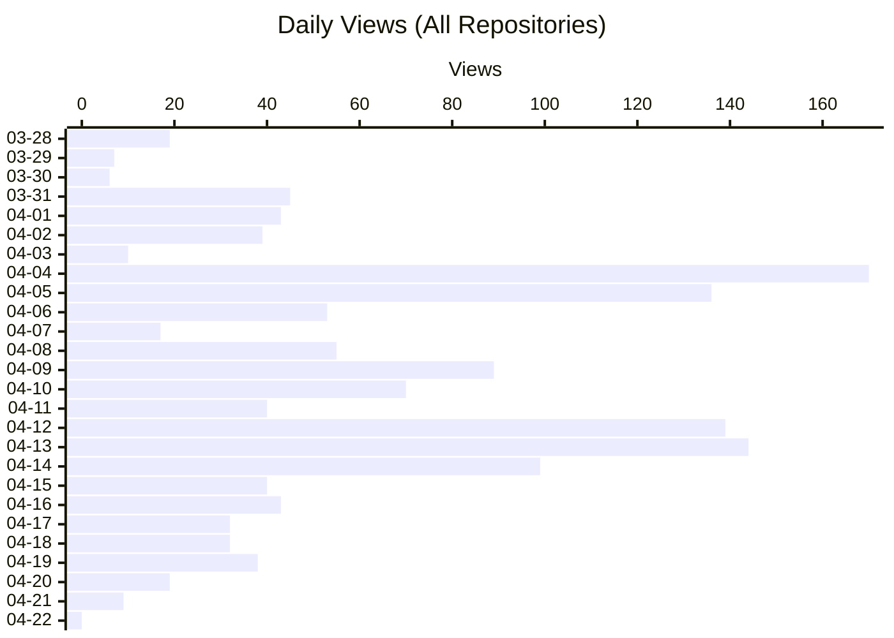
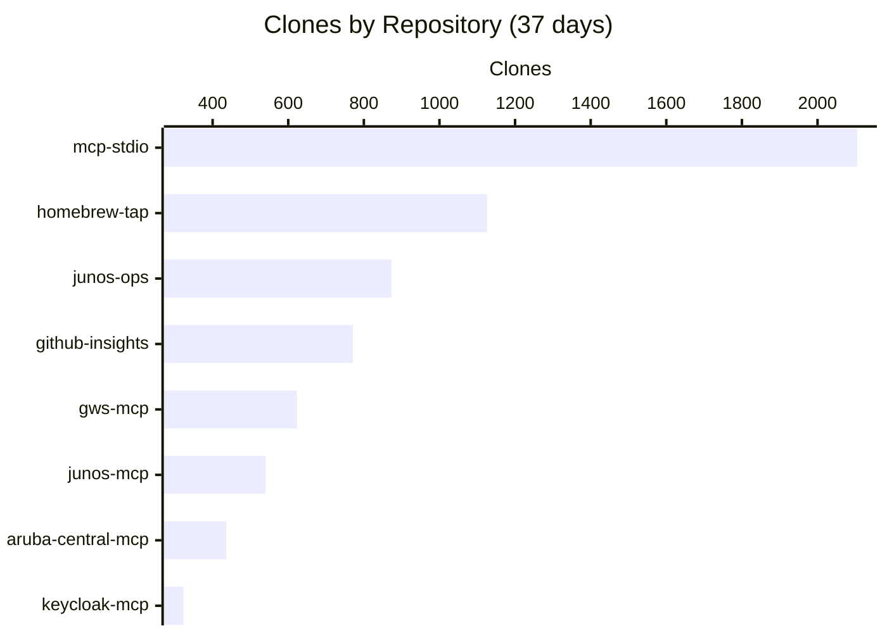

# github-insights

GitHub Traffic insights dashboard for [shigechika](https://github.com/shigechika) repositories.

**Live dashboard**: https://shigechika.github.io/github-insights/

[](https://shigechika.github.io/github-insights/)

<!-- CHARTS:START -->
## Insights

> Last updated: 2026-04-22T12:42:52Z

### Views by Repository



### Daily Views



### Clones by Repository



### Repositories

| Repository | Description |
| --- | --- |
| [aruba-central-mcp](https://github.com/shigechika/aruba-central-mcp) | MCP server for Aruba Central: expose AP, switch, and client status to AI assistants |
| [github-insights](https://github.com/shigechika/github-insights) | GitHub Traffic insights dashboard — aggregates views/clones across a user's public repositories |
| [gws-mcp](https://github.com/shigechika/gws-mcp) | MCP fork of Google Workspace CLI — exposes Drive, Gmail, Calendar, Sheets, Docs, Chat, Admin, and more to AI assistants. Dynamically built from Google Discovery Service. Includes AI agent skills. |
| [homebrew-tap](https://github.com/shigechika/homebrew-tap) | Homebrew tap for junos-ops, mcp-stdio and speedtest-z |
| [junos-mcp](https://github.com/shigechika/junos-mcp) | MCP server for Juniper/JUNOS — show, upgrade with rollback, config push (commit confirmed) with safe dry-run defaults, RSI/SCF collection |
| [junos-ops](https://github.com/shigechika/junos-ops) | Python CLI to automate Juniper/JUNOS operations over NETCONF: model-aware upgrade, rollback, reboot, config push, and RSI/SCF collection |
| [keycloak-mcp](https://github.com/shigechika/keycloak-mcp) | MCP server for the Keycloak Admin REST API — a strong ally for auth troubleshooting: inspect users, sessions, clients, and realm config through AI assistants. |
| [mcp-stdio](https://github.com/shigechika/mcp-stdio) | Stdio-to-HTTP gateway — connects MCP clients to remote HTTP MCP servers |
<!-- CHARTS:END -->

## Overview

GitHub only retains traffic data (views & clones) for **14 days**. This project collects and preserves that data daily via GitHub Actions, building long-term traffic history.

## Features

- **Interactive dashboard**: Stacked area charts (views & clones) on GitHub Pages with 30d / 90d / 1y / All range toggles
- **Cross-repository aggregation**: Unified stats across all public repositories of the owner
- **Rename-aware**: Detects repository renames via GitHub API's 301 redirect and merges history under the new name automatically
- **Long-term retention**: Preserves traffic data beyond GitHub's 14-day window

## How it works

1. **Daily collection**: GitHub Actions runs `scripts/collect.sh` on a cron schedule
2. **Data storage**: Traffic snapshots are merged into `data/traffic.json`, deduplicating by timestamp
3. **Visualization**: The dashboard at `docs/index.html` fetches `data/traffic.json` from `raw.githubusercontent.com` and renders stacked area charts with Chart.js

## Use this as a template

Click **Use this template → Create a new repository** at the top of this repo to spin up your own dashboard. After creating your copy:

1. **Reset the data** so the dashboard starts fresh for your account:
   ```bash
   echo '{"updated_at":"","views":{},"clones":{}}' > data/traffic.json
   git commit -am "chore: reset traffic data"
   git push
   ```
2. **Create a Fine-grained PAT** at <https://github.com/settings/personal-access-tokens/new>:
   - **Token name**: anything descriptive, e.g. `github-insights`
   - **Repository access**: **All repositories** or **Only select repositories** (the *Public repositories* preset cannot grant the Administration permission required by the Traffic API)
   - **Permissions → Repository → Administration**: **Read-only**

   > **Note**: Although "All repositories" technically grants access to your private repos as well, this tool only fetches traffic for **public** repositories — `scripts/collect.sh` lists them with `gh api users/<owner>/repos?type=public`. The PAT is also limited to *read-only* metadata via the **Administration** permission.
3. **Add the token as a secret** named `GH_INSIGHTS_PAT` (Settings → Secrets and variables → Actions → New repository secret).
4. **Enable GitHub Pages** at Settings → Pages:
   - Source: **Deploy from a branch**
   - Branch: `main` / Folder: `/docs`
5. **Run the workflow** once to seed data:
   ```bash
   gh workflow run collect.yml
   ```
   Wait a minute, then visit `https://<your-username>.github.io/<your-repo>/`.

After that, the cron runs automatically. Once a day is plenty — adjust the schedule in `.github/workflows/collect.yml` to suit your needs. Avoid scheduling at the top of the hour (especially `00:00 UTC`) since [scheduled workflows can be delayed during periods of high load](https://docs.github.com/en/actions/using-workflows/events-that-trigger-workflows#schedule).

## License

[MIT](LICENSE) — Originally created by [shigechika/github-insights](https://github.com/shigechika/github-insights)
