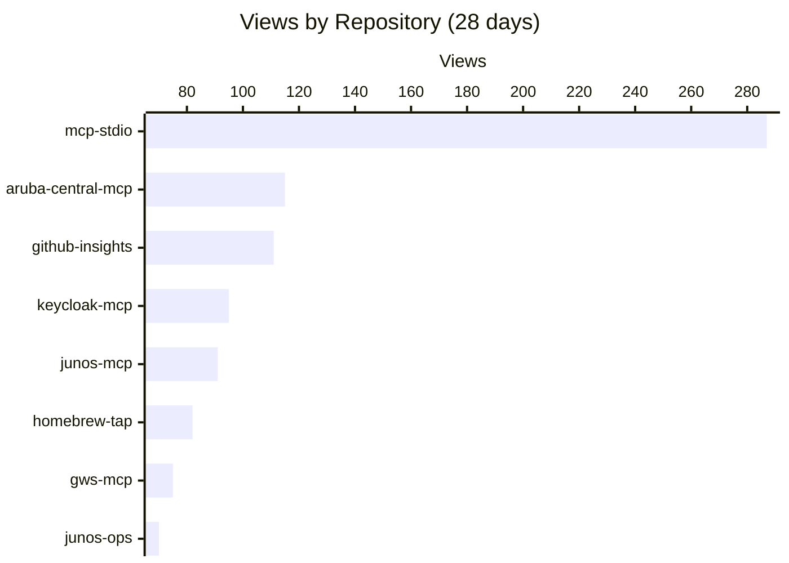
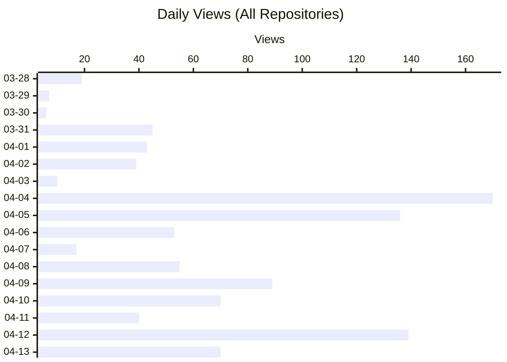
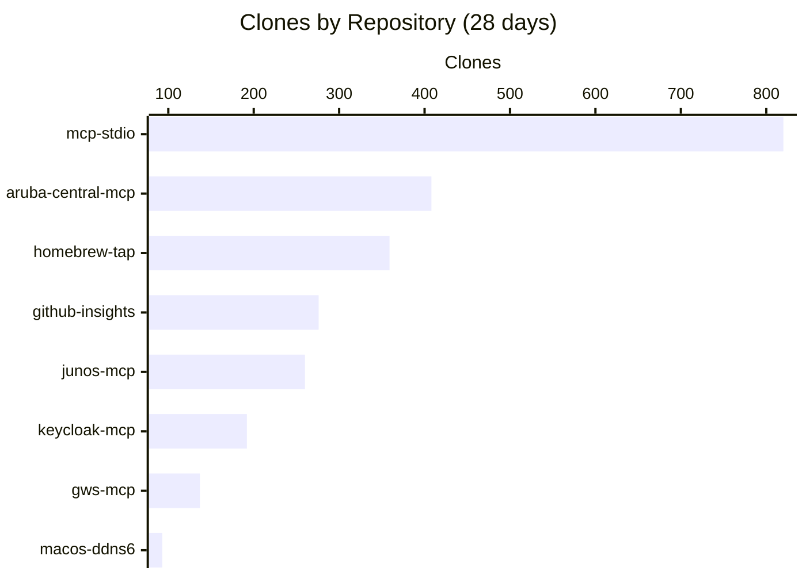

# github-insights

GitHub Traffic insights dashboard for [shigechika](https://github.com/shigechika) repositories.

<!-- CHARTS:START -->
## Insights

> Last updated: 2026-04-14T07:05:46Z

### Views by Repository



### Daily Views



### Clones by Repository



### Repositories

- [aruba-central-mcp](https://github.com/shigechika/aruba-central-mcp) — MCP server for Aruba Central: expose AP, switch, and client status to AI assistants
- [github-insights](https://github.com/shigechika/github-insights) — GitHub Traffic insights dashboard for shigechika repositories
- [gws-mcp](https://github.com/shigechika/gws-mcp) — MCP fork from Google Workspace CLI — one command-line tool for Drive, Gmail, Calendar, Sheets, Docs, Chat, Admin, and more. Dynamically built from Google Discovery Service. Includes AI agent skills.
- [homebrew-tap](https://github.com/shigechika/homebrew-tap) — Homebrew tap for junos-ops and speedtest-z
- [junos-mcp](https://github.com/shigechika/junos-mcp) — MCP server for Juniper/JUNOS — exposes junos-ops (upgrade, rollback, config push with commit confirmed, show, RSI) to AI assistants with safe dry-run defaults
- [junos-ops](https://github.com/shigechika/junos-ops) — Python CLI to automate Juniper/JUNOS operations over NETCONF: model-aware upgrade, rollback, reboot, config push, and RSI/SCF collection
- [keycloak-mcp](https://github.com/shigechika/keycloak-mcp) — MCP server for KeyCloak Admin REST API via Service Account (Client Credentials Grant)
- [macos-ddns6](https://github.com/shigechika/macos-ddns6) — Dynamic DNS updater for macOS — detects IPv6 SLAAC autoconf secured addresses and updates DNS records
- [mcp-stdio](https://github.com/shigechika/mcp-stdio) — Stdio-to-HTTP gateway — connects MCP clients to remote HTTP MCP servers
<!-- CHARTS:END -->

## Overview

GitHub only retains traffic data (views & clones) for **14 days**. This project collects and preserves that data daily via GitHub Actions, building long-term traffic history.

## Features

- **Cross-repository aggregation**: Unified stats across all public repositories of the owner
- **Rename-aware**: Detects repository renames via GitHub API's 301 redirect and merges history under the new name automatically
- **Long-term retention**: Preserves traffic data beyond GitHub's 14-day window

## How it works

1. **Daily collection**: GitHub Actions runs `scripts/collect.sh` at 00:00 UTC (09:00 JST)
2. **Data storage**: Traffic snapshots are merged into `data/traffic.json`, deduplicating by timestamp
3. **Visualization**: (Phase 2) Stacked area charts via GitHub Pages + Chart.js

## Manual trigger

```bash
gh workflow run collect.yml
```

## Setup

Requires a Fine-grained PAT with **Administration: Read-only** permission, stored as `GH_INSIGHTS_PAT` in repository secrets.

## Roadmap

- [x] Phase 1: Daily traffic collection via GitHub Actions
- [ ] Phase 2: GitHub Pages + Chart.js stacked area charts

## License

[MIT](LICENSE) — Originally created by [shigechika/github-insights](https://github.com/shigechika/github-insights)
