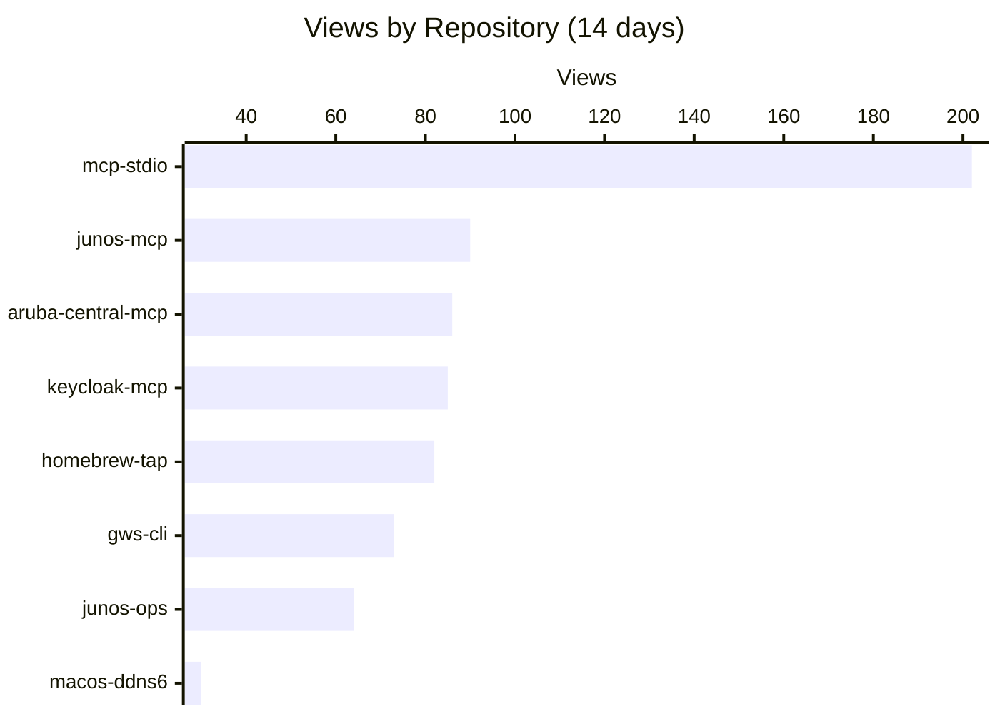
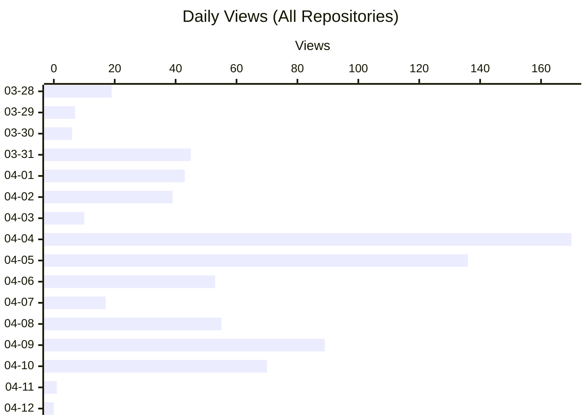
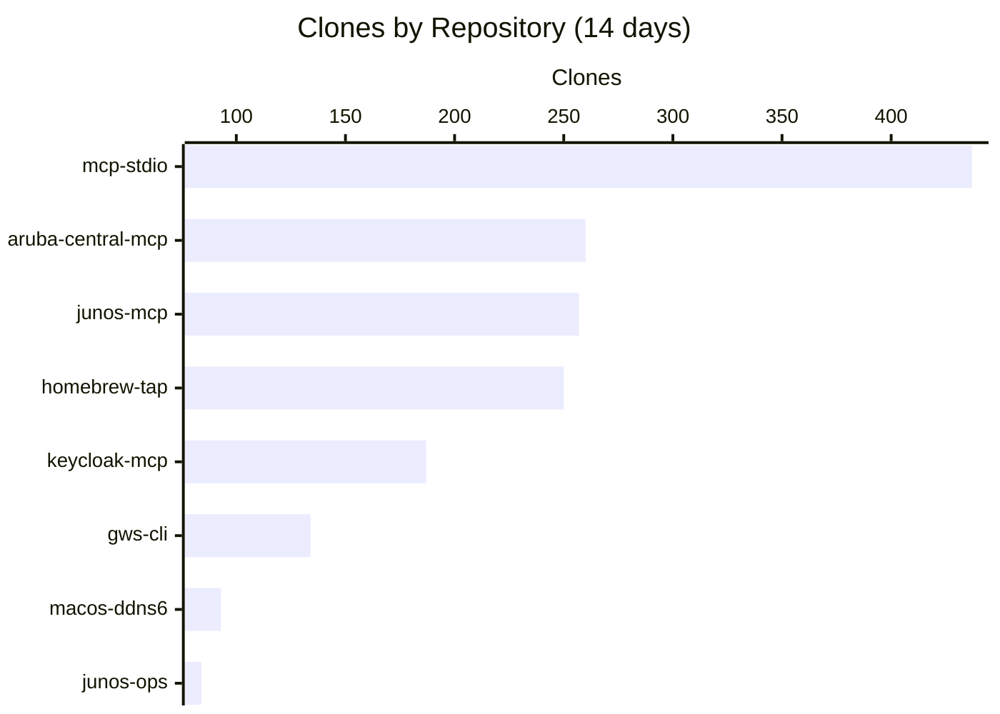

# github-insights

GitHub Traffic insights dashboard for [shigechika](https://github.com/shigechika) repositories.

## Overview

GitHub only retains traffic data (views & clones) for **14 days**. This project collects and preserves that data daily via GitHub Actions, building long-term traffic history.

## How it works

1. **Daily collection**: GitHub Actions runs `scripts/collect.sh` at 00:00 UTC (09:00 JST)
2. **Data storage**: Traffic snapshots are merged into `data/traffic.json`, deduplicating by timestamp
3. **Visualization**: (Phase 2) Stacked area charts via GitHub Pages + Chart.js

## Manual trigger

```bash
gh workflow run collect.yml
```

## Setup

Requires a Fine-grained PAT with **Administration: Read-only** permission, stored as `GH_INSIGHTS_PAT` in repository secrets.

<!-- CHARTS:START -->
> Last updated: 2026-04-12T05:45:22Z

### Views by Repository



### Daily Views



### Clones by Repository


<!-- CHARTS:END -->

## Roadmap

- [x] Phase 1: Daily traffic collection via GitHub Actions
- [ ] Phase 2: GitHub Pages + Chart.js stacked area charts
